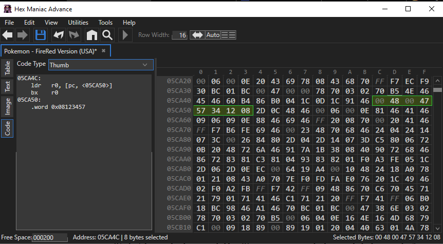

# May 3rd 2021
May 04, 2021
---
We are glad to announce that we did manage to finish the script. Now tests are being made to know which sprites can be cloned and how we can use that info to our advantage. The rest of this post will be explaining what errors we made and how we solved them.

The assembly script (ASM script for short) was taken from [this post on PokéCommunity](https://www.pokecommunity.com/threads/asm-resource-thread.339153/page-23#post-8620314) (credits to user FBI for making this useful yet compact code).

The first code, which must be written in free space, is where the magic happens. Again, we do not know ASM so some of it is still out of our understanding.

Bro tip: free space starts on 0x71A260. There is written space after this, of course, and that address might already contain data if you edited sprites or wrote scripts before trying this. There is also dedicated software to find free space in your ROM so if you need further assistance on finding free space, you should use those tools. They are very useful for any kind of hacking you do to the ROM.

This code will first check the flag 0x406 and reference variable 0x8000. Flag 0x406 will start the routine and 0x8000 will specify what sprite we want to reference. For some reason, different values may refer to the same sprite, we are still unsure why and how to expand that.

If 0x8000 is set to FF (meaning it is invalid/free space), the game should crash. However, in order to have it not crash, a code similar (but not exactly like) the code for the default character overworld sprite is referenced (in noCrash).

In address 0x5CA4C, we have a few bytes that take care of what sprite to show as the player. We want this code to be replaced by the one we just copied in free space, since that one gives us more freedom on what sprite will appear.

However, there's too little space for us to simply copy and paste it. If we did, we would overwrite code that normally takes care of other parts of the game.

Unfortunately, there are very few programs that are actually able to solve this, so we must do it manually. When a program does it, it will usually repoint the data, meaning it will say "sorry, we moved this data to the specified address" or simply replace all the metadata that references that.

So, in 0x5CA4C, we will want to call the ASM script we left in free space. For that to work, we will reference the address where we put the ASM script, though we will reference the second byte of the script. We don't know why this is needed but JK, our programmer, thinks it might be because the first byte, when compressed, is invalid (FF). However, we are unsure.

Let's use address 0x123456 as an example. Note that THIS IS NOT FREE SPACE and will be simply an example for a simpler explanation.

We will overwrite 0x5CA4C with 00 48 00 47, and then we call our address, 123457 (0x123456+1). To call an address as a pointer, however, and this is of extreme importance, we will have to reverse the order of the bytes. That is, since our address is 0x123457, it will be read as 12 34 57. To call as a pointer, we will need to write it as 57 34 12. Lastly, add 08.

 A pointer is used when you want to reference an address in the ROM. The pointer will look like the address' bytes in reverse order. That simply has to do with how the game code is compiled and read.

In this example, 0x5CA4C should look like this:

Again, remember that 0x123456 is NOT a valid address for you to call, as it is not originally free space and already has code. This is only an example.

We put the ASM script in 0x71A260 so our
0x5CA4C address reads as follows:
`00 48 00 47 61 A2 71 08`

If you did everything correctly, there shouldn't be any problems when making a new save file.

Now, the last thing you must do is to make a script that will set the flag in 0x406 and set the variable 0x8000 to whatever value you want. Remember that, for a specific sprite to appear, you must set 0x8000 to the equivalent value in [the table of values in the original post.](https://www.pokecommunity.com/threads/asm-resource-thread.339153/page-23#post-8620314)

This script can start whenever you want. You can set the flag and variable when you interact with the NES, you can set them when starting a new game, you can set them when you receive your first pokemon... You can set them at literally any point in the story. Remember that, in order for the effect to take place, you will need to warp.

And with that, we're happy to announce that version 0.02 Alpha is back in development! New skins will be added as we go on.

Brace yourselves, Alpha 0.02 is approaching fastly.