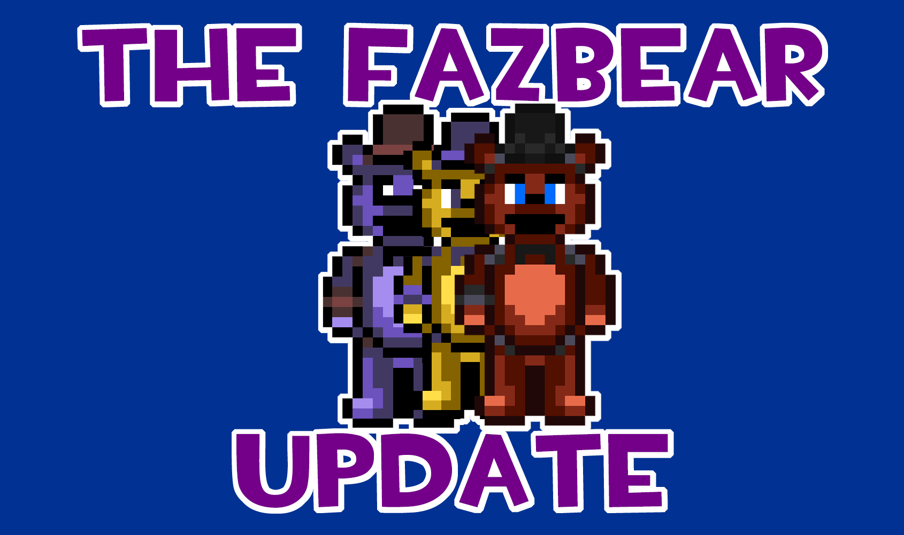

#  Patch v0.02.5 Alpha - The Fazbear Update!
---
June 17, 2021

Over the last week, we have been hard at work in changing things on our project. A few of them are incomplete, some are hidden away. However, after today's heartbreaking news, it is only right that we open the box and show you what we have in store.

 

If you are interested in playing this version of the rom hack, [here is the thing]((v0.02.5%20ALPHA)%20Five%20Nights%20at%20Freddys%20-%20The%20Minigame%20Investigator.ups). As always, you will need the original Fire Red 1.0 rom, and a .ups patcher. Please read both the features list AND the issues list before playing.

Update includes:
+ A new Freddy OW sprite (which will still be used by the Crush Girl trainer class)*
+ An incomplete Foxy OW sprite (used by the male hero [Emerald/Ruby/Sapphire])*
+ A Fredbear OW sprite (used by the Birdkeeper trainer class)*
+ A Shadow Freddy OW sprite (used by the Beauty trainer class)*
+ A plush Fredbear OW sprite (used by Kangaskan)*
+ The FNaF 1's pizzeria (with placeholder tiles)
+ The NES on the player's room turns the player into Freddy AND takes them to the pizzeria
+ A version of Bonnie's Lullaby (aka Schübert's Serenade), which will go on top of the FNaF 1 pizzeria
+ The Elite Games' logo (mind rune) has taken the place of the Game Freak logo

Note: Overworld sprites are not seen in battle.

If you think you can do better assets, please contact JK on Twitter to submit them! You can find JK's Twitter page here.
Known issues:

+ When the OW sprite is changed (to Freddy, for example), opening menus that change the player's sprite will revert it back to its original form (ghost child for the male hero, Purple Man for the female hero), but the colour pallette will stay the same
    - Hiding the player's sprite a second time will fix the colour pallette back to its original state
    - The only way to fix this is by warping (walk into the FNaF 1 office)
+ The FNaF 1 map has no exit
    - It is impossible to get out of the place without restarting the game
+ The NPCs look glitched
    - The colour pallettes have been altered, there is no fix until the next update
+ The FNaF 1's back room has the "Surf" melody instead of Bonnie's Lullaby
    - The FNaF 1's office room is protected from rain and has no music associated with it
+ The PC's in the FNaF 1's room work
+ There is no Pirate Cove room, which is only seen in the FNaF 2 minigames
    - There is also no kitchen or cleaning supplies room, because it's not accessible during the FNaF 3 minigames

All of these issues will be addressed in the next update. We are also making some changes to basic parts of the game (such as overworld sprite loading and quality of life features). That means that we will have less time to work on new features but we promise to bring, along with the next major update:

+ The FNaF 2 map (as seen in SAVETHEM)
+ The Grandfather's Clock jingle for the Pupper's room
+ Fixes to most of the issues in the 0.02.5 ALPHA version
+ A way of checking in on development without interfering with the Pokemon campaign

Please note that "major update" does not include the next actual update. We'll be working with different software from now on and having to pump out new content for the next update (when the biggest change in development is going to be internal) would be demotivating for us.  Next update will  rather focus on trying to bring in the same features we had before, whilst still fixing some of the issues we have now. The player will not be able to turn into an animatronic on demand in the next few updates, unfortunately. However, solving that is one of our priorities (as it is also one of the most important features).
Other features that are still be worked on are the main 4 animatronics, the tilesets to finally make the pizzerias come to life, a design for our main character, the story and so, so much more!

## DISCLAIMERS

This version of the game is not transformative enough for us to feel at ease distributing it in full publically. That is why this version is merely a patch to the original game but not a .gba file. We will NOT distribute versions of the game that resemble the original game too much in gameplay in order to avoid copyright problems. All versions of the game until beta will only be available in .ups files. The final version will be available as a .gba and a .ups file.

In order to apply a patch, you must have a copy of the original game. This hack will only be available in version 1.0 of Pokemon Fire Red (US), as most hacking tools are unfit to work with version 1.1. If you have a physical copy of the game, extract the rom in order to have a safe backup before making any sort of changes. Then apply the patch.

The maps currently being worked on are not necessarily going to be included in the next patch. They will also not necessarily be accessible through normal means until the Beta versions are released. However, you may notice differences in graphics during normal gameplay. This is expected, since we are actively working on changing the visual of the tilesets. That is not only for copyright reasons but also to give the team more freedom over the visual look of the game. The Pokemon Kanto region will not be accessible in the final version so the visual tiles will not break anything integral to the core experience.