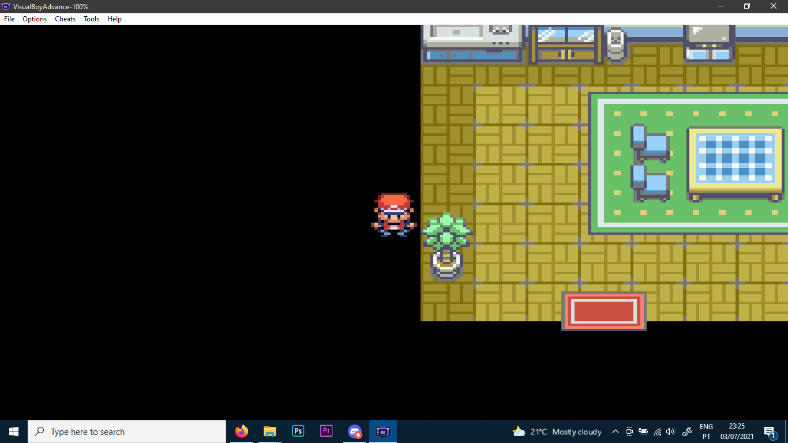

# Patch v0.03.1 Alpha - Miles' Room and the unfortunate setback
July 03, 2021
---
Hey everyone! Glad you're back!

If you don't know us, we are Elite Games, a small indie team, currently working on a Five Nights at Freddy's fangame called The Minigame Investigator. For more info about the project, click [here](../0.01/faq.md).

We just wanted to give a quick update about the game.

We've changed the plans. We're no longer editing pokemon Fire Red. Instead, we've switched for emerald instead. That's because there's more resources for modding decompiled Emerald than there are for modding decompiled Fire Red. From now on, Minigame Investigator will be an Emerald rom hack and will require that to work.

Another important thing that you might see is that a few vanilla things will eventually break. That's completely normal. We'll not be adding new content unless it is necessary. Instead, we'll be editing already existing content. That's because we want it to be playable in actual hardware (not that we will be able to but it's interesting to have that as an option).

As you all know, after porting to Fire Red (and, later, to Emerald) we had to re-import everything. This means that everything is being ported over. Again. You'll be able to see the changes made to Fire Red before porting over to emerald in this post. Next week, we'll be showcasing these exact changes and more, but on Pokemon Emerald.

We kind of didn't want to make this post today (what we did will be redone next week) but we wanted to make this as a memo for us to remember that.

Here's what he have accomplished over the last week:

+ Miles' Room has been added
+ Freddy Fazbear's Pizza (FNaF 1) has been added
+ Freddy Fazbear has been added
+ Fredbear has been added
+ Shadow Freddy has been added
+ Ghost Child has been added
+ Fredbear Plushie has been added
+ The Game Freak Logo has been changed to the Mind Rune
+ The "Game Freak" text has been changed to read "Elite Games"

This brings in a few problems, of course.

+ The vanilla game is only playable until the 3rd gym leader, since the  S. S. Anne maps have been used for Freddy Fazbear's Pizza; Surf is no longer obtainable
+ Freddy's sprite cannot be displayed correctly; this is due to the palettes not being dynamic and will be fixed in the next update

If you still want to access the new content,  you must access Miles' Room. For that to happen, you'll need to...

If you want to download this update, [here's the link]((v0.03.1%20ALPHA)%20Five%20Nights%20at%20Freddys%20-%20The%20Minigame%20Investigator.ups).

If you think you can do better assets or have any questions, concerns or criticisms, please write a comment on this post or contact JK on Twitter to submit them! You can find JK's Twitter page [here](https://twitter.com/JK0JK_).

In any case, next week we'll have a new update with better quality but until then, we'll be waiting. Thank you for being awesome!

## DISCLAIMERS

This version of the game is not transformative enough for us to feel at ease distributing it in full publically. That is why this version is merely a patch to the original game but not a .gba file. We will NOT distribute versions of the game that resemble the original game too much in gameplay in order to avoid copyright problems. All versions of the game until beta will only be available in .ups files. The final version will be available as a .gba and a .ups file.

In order to apply a patch, you must have a copy of the original game. This version of the hack will only be available in version 1.0 of Pokemon Fire Red (US), as most hacking tools are unfit to work with version 1.1. If you have a physical copy of the game, extract the rom in order to have a safe backup before making any sort of changes. Then apply the patch.

The maps currently being worked on are not necessarily going to be included in the next patch. They will also not necessarily be accessible through normal means until the Beta versions are released. However, you may notice differences in graphics during normal gameplay. This is expected, since we are actively working on changing the visual of the tilesets. That is not only for copyright reasons but also to give the team more freedom over the visual look of the game. Neither the Pokemon Kanto or Hoenn regions will not be accessible in the final version so the visual tiles will not break anything integral to the core experience.
