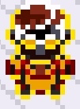
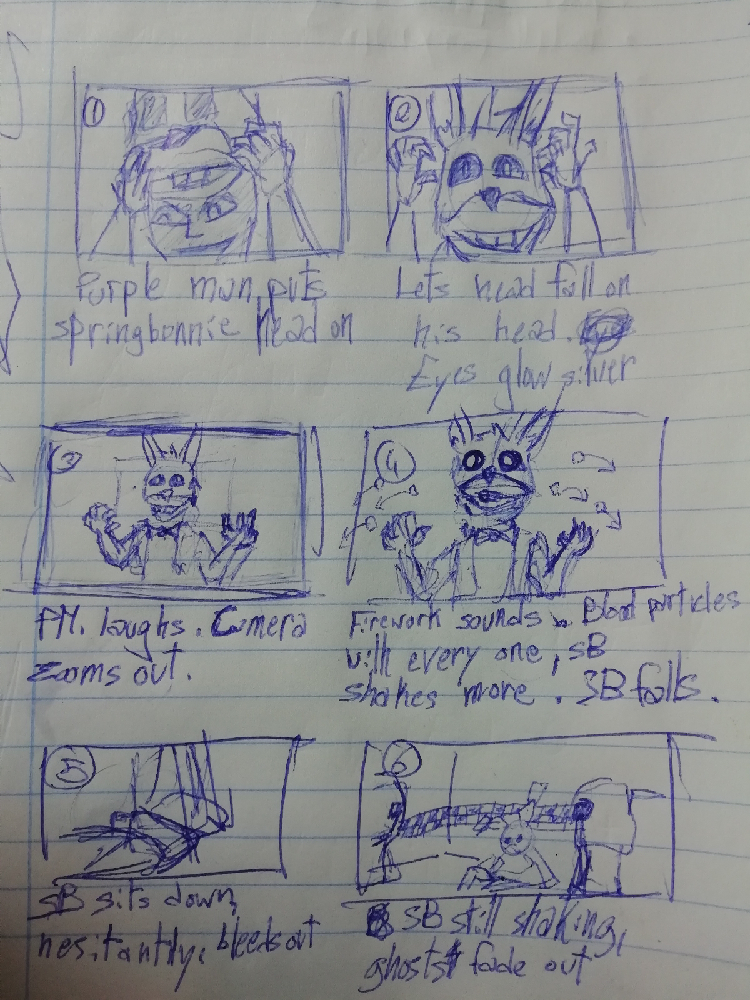

# Jun 21st - A downgrade for an upgrade
June 21, 2021
---
Hey everyone! Welcome back!

We've made an update to the project recently, which we called the Fazbear Update, since it mainly introduced three variations of Freddy (Freddy Fazbear, Fredbear and Shadow Freddy), as well as a recreation of the Freddy Fazbear's Pizza map, as seen in the FNaF 3 minigames, as well as other hidden minor features. If you haven't checked it out already, [here's the full log.](../0.02/17-06-21-2.md)

 
There were a lot of things that were either missing or failing, both aesthetically but also in terms of game design. There's a good reason for that, though.

This post is going to be a bit technical but we'll try to explain everything in the easiest way to understand.

You may have seen in the "known issues" list a lot of problems. Here's an explanation for most of them.

Unedited overworld sprites got their colour pallettes with wrong colours, resulting in horrible atrocities like this poor scientist.

 
This could be fixed if a new colour pallette was created for animatronics that needed it, instead of reusing and altering existing ones. We don't really know how to do that unless we use a 3rd party patch.

Another problem we have ran into is the overworld sprite switch script/routine we've been talking about in the past. It was created by [FBI in the Pokecommunity](https://www.pokecommunity.com/threads/asm-resource-thread.339153/page-23#post-8620314). It was [relatively easy to implement](../0.02/03-05-21.md) and use and it was exactly what we were looking for. However, it also came with its own bugs.

For instance, once you hide the player's sprite, it will go back to its original form, but still having the colour pallette we gave. Hiding the sprite a second time will reset it completely.

The best way of solving this is using JPAN's Fire Red hacked engine, a tool that, coincidentally, allows for more overworld sprites and pallettes.

This sounds amazing, right? A simple patch that solves all the problems we had up until now!

Except not. There is still a few things that we want to do that are, well, next to impossible to do without proper knowledge of how to write in assembly or even understanding the code each byte is trying to convey. That kind of work is almost next to impossible for a human and even dedicated software like HexManiacAdvance is only able to read certain parts of the game.

What are we talking about? Well, here is an example.

We've wanted to use little cutscenes (like those seen in the credits and opening sequence of the game) to depict the most important moments in the minigames. For instance, this is the storyboard of Purple Man's supposed death, based on FNaF 3's end of night 5 minigame.

 
This is impossible to do in the GBA without easy-to-use code. The best way of doing this, then, is by decompiling the game, meaning that we'll using a "translated" version of the game, which can export the game easily. A lot of the game has already been reverse engineered, so it's completely doable!

The "translation" (known as "decompiled [game]") is written in C, a very easy to comprehend programming language. Some of the members on our team dream of one day joining the industry as programmers after this project (and maybe even presenting it on their resume) and so experience with C is going to be of great importance to us, when compared to ASM, which is rarely written manually.

Unfortunately, the decompiled version of the code doesn't support rom hacks, meaning that, in addition to learning how to work with decompiled fire red, we'll also need to re-import all the sprites, maps and scripts we made until this point.
 
 
That also means that the "overworld change script" will have to be replicated. However, seeing as C is easier to understand and write to and since the decomp community is always ready to lend you help, that is not going to be an important concern.

Fortunately, that also means that we won't have to deal with redundant code or other mistakes we made in the past.

So, just to make everything clear:

+ we'll be modding Fire Red's decompiled code instead of "binary hacking"
    - this will give us more freedom on what features to add and how to add them
        + some of these features were previously impossible, such as cutscenes or quality of life features
    - experience with C is more useful in the industry and a valuable skill for our programmers
+ we will be re-introducing every feature, resulting in:
    - cleaner code
    - vanilla npc's looking normal
    - less oversights
+ expect to see an initial downgrade in content for the first few updates (0.03 Alpha line)
    - expect to se an upgrade in content quality after 0.04 Alpha

Anyway, thank you for reading this far! If you have any questions or concerns, you can [contact JK on Twitter](https://twitter.com/JK0JK_) or leave them here in the comments! Thank you for being awesome, we'll continue to update you next week!
