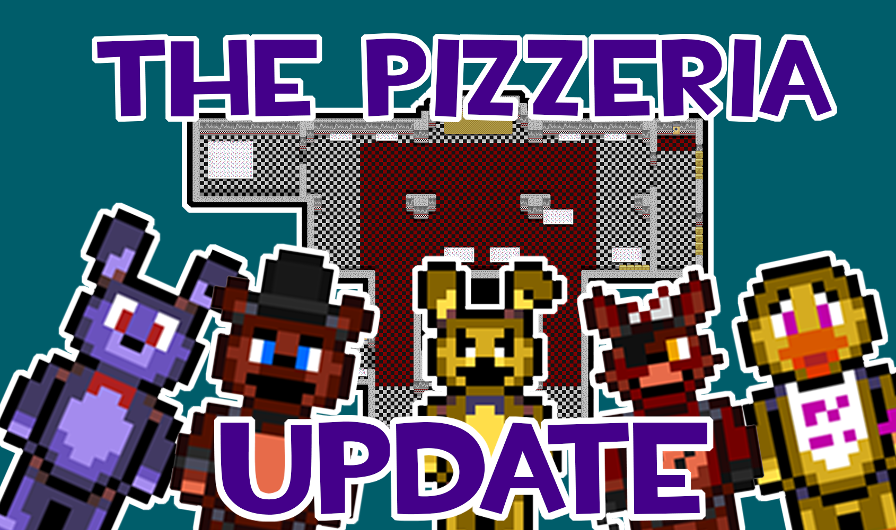

# FNaF's 7th Anniversary - Alpha 0.05.10 - The Pizzeria Update
August 09, 2021
---
Hey everyone! Glad to see you here! 

If you don't know what Minigame Investigator is, [check out the FAQ on our blog](../0.01/faq.md) to know more about our fangame!

Yesterday was FNaF's 7 year anniversary, and so we wanted to release an update! This one was quite beefy and it has a ton of new content, so that also means that debugging took us a long time. In fact, the reason why the update didn't release in time was exactly because of that!

This update is one of our most exciting to date! We're moving closer and closer to a beta version and this was a huge step! This is the Pizzeria Update!

[Go here]((v0.05.15%20ALPHA)%20Five%20Nights%20at%20Freddys%20-%20The%20Minigame%20Investigator.ups) to get the patch! Remember that you will need to have the original Pokemon Emerald ROM in order for this to work! Here's the list of features:
Here's the list of features:

+ The FNaF 3 end-of-night minigames have finally been remastered!
    - There is a room in Miles' room that will make you choose the night
    - Foxy, Bonnie, Chica and Ghost have been added as playable characters
        + To play as each of them, select the corresponding night in Miles' room
    - FNaF 1's map now has its own tiles
        + Now it looks like an actual pizzeria
    - Shadow Freddy's walk cycles have been recreated
    - The ERR cutscene has been recreated
        + Scraps for each animatronic are now seen when the dismantling finishes
    - The back room's sequence has been recreated
        + Purple Man now runs from you
        + Purple Man will enter the Springbonnie suit once he feels cornered
        + This will lead to his crushing and persumed death, with an animation that will not be present in the final verison
    - Parts and Services now has scraps of the animatronics
    - The cleaning supplies room in the west hall has been recreated
    - New boxes block the passage to the bathrooms and kitchen
+ Miles now appears in his room!
    - He will explain how the place works
    - After that, he will sit by the entrance
        + You can now interact with him
    - Miles will remember the version you last saved in
        + To migrate a save file from one version to another, simply rename the .sav file to be equal to the .gba's name
    - Miles will tell you four stories, before telling you that he'll just repeat them again
    - When asked about it, Miles will tell you about this update and the next
    - Don't tell him we suck, he's very sensitive about it

With this, the FNaF 3's end of night minigames are dealt with! Now, we'll focus on other, maybe less important aspects. FNaF 1's maps have shown us what we can succeed at and what our limitations are. It's also a good sample to judge what kind of thing you can expect from Minigame Investigator. With that part out of the way, we will now have do some progress in other areas, like, for example:

+ More Minigames - SAVETHEM and FOXY GO! GO! GO! come to mind, the latter of which requires us to add Pirate Cove first
+ More pretty tiles - arcades, curtains, posters, and the stage's white stars
+ Expressions - what we have now is too boring, and we want you to feel genuine connections with these characters!
+ More human characters - Player's actual character, child corpse, Arsonist, Michael Afton, and others
+ More animatronics - Puppet, Mangle, Balloon Boy, Toys, Withereds and Golden Freddy are the obvious choices for now
+ And much more!

Not all of these are going to be present in the next update, however. This one really pushed us a lot, and we want some time to rest before doing anything major. We'll be sure to come back with something interesting in the next update, but it will not be as packed as this one.
If you have any concerns, if you want to state your opinion on anything, or if you have found a glitch, [send a message to JK on Twitter](https://twitter.com/JK0JK_)! We'll be sure to try to fix it by next update, and any feedback is important!

With that said, it's time for us to rest for a while. Thank you for being awesome, and we'll see you on the next update!

## DISCLAIMERS

Emulating games is not illegal. Making the games available without the consent of the publisher, however, is. That is why we do not make the .gba file available. However, and since  it's been almost 17 years since Pokemon Emerald was released, it's pretty easy to get yourself a copy of it.

 This version of the game is not transformative enough for us to feel at ease distributing it in full publically. That is why this version is merely a patch to the original game but not a .gba file. We will NOT distribute versions of the game that resemble the original game too much in gameplay in order to avoid copyright problems. All versions of the game until beta will only be available in .ups files. The final version will be available as a .gba and a .ups file.

In order to apply a patch, you must have a copy of the original game. If you have a physical copy of the game, extract the rom in order to have a safe backup before making any sort of changes. Then apply the patch.
The maps currently being worked on are not necessarily going to be included in the next patch. They will also not necessarily be accessible through normal means until the Beta versions are released. However, you may notice differences in graphics during normal gameplay. This is expected, since we are actively working on changing the visual of the tilesets. That is not only for copyright reasons but also to give the team more freedom over the visual look of the game. The Hoenn region will not be accessible in the final version so the visual tiles will not break anything integral to the core experience.